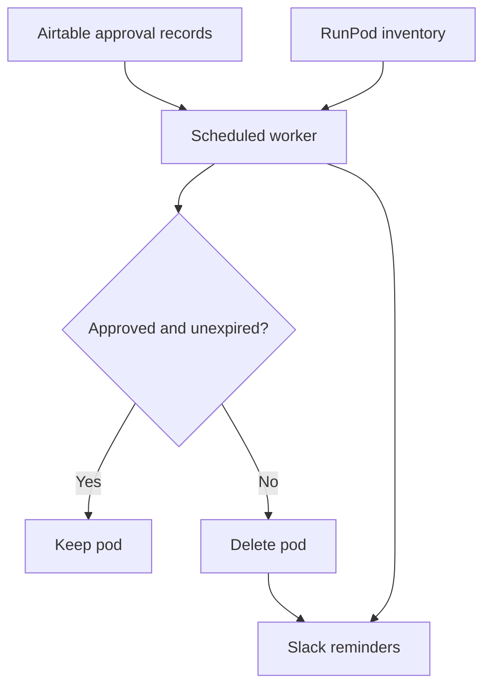

# RunPod Compute Management

A lightweight Node.js service for deleting RunPod compute pods, with a documented workflow for managing compute requests, approvals, expiry reminders, and cleanup through Airtable, Slack, and Railway.

The goal is to connect temporary compute access to an approval and expiry process, helping teams keep track of shared GPU resources.

## Implementation status

The `index.js` version accompanying this README implements an HTTP deletion webhook. The project's technical documentation also describes a separate scheduled cleanup worker. That worker's Airtable and Slack logic is **not implemented in this version of `index.js`**.

| Component | Status in this version |
| --- | --- |
| `POST /delete-pod` webhook | Implemented in `index.js` |
| RunPod deletion by pod ID | Implemented |
| Shared-secret check | Implemented only when `WEBHOOK_SECRET` is set |
| Airtable request and approval automations | Configured outside the JavaScript service; described below |
| Scheduled expiry checks and cleanup | Described in the technical documentation; requires a separate worker |
| Slack bot reminders and deletion notices | Described for the scheduled worker; absent from the webhook |

## Technology

- **JavaScript / Node.js:** built-in HTTP server and `fetch`; no external runtime dependencies declared.
- **RunPod REST API:** pod deletion, plus inventory retrieval in the documented scheduled workflow.
- **Airtable:** request intake, approval records, and expiration dates.
- **Slack:** request notifications, approval confirmations, and worker notifications.
- **Railway:** service hosting and, for a separate worker, scheduled execution.

## Run the webhook

Keep these files at the repository root:

| File | Purpose |
| --- | --- |
| `index.js` | HTTP server and RunPod API request |
| `package.json` | Project metadata, runtime requirement, and start command |
| `README.md` | Setup, behavior, and system documentation |

The package declares Node.js `>=18`. Use a [currently supported LTS release](https://nodejs.org/en/about/previous-releases) for deployment; Node.js 18 is end of life.

### Environment variables

| Variable | Purpose | Requirement |
| --- | --- | --- |
| `RUNPOD_API_KEY` | API credential authorized to delete the intended pods | Needed for RunPod requests; currently not validated at startup |
| `WEBHOOK_SECRET` | Shared secret expected in the JSON request body | Set a strong value before exposing the endpoint |
| `PORT` | HTTP listening port | Optional; defaults to `3000` |

> [!IMPORTANT]
> The current code skips authentication if `WEBHOOK_SECRET` is unset or empty. Anyone who can reach that endpoint could then request deletion of a pod accessible to the configured API key. Set this variable and require it at startup before operating a public deployment.

Set the variables in your hosting provider's secret settings or your local shell. For a local Bash session, replace the placeholders before starting:

```bash
export RUNPOD_API_KEY='<your-runpod-api-key>'
export WEBHOOK_SECRET='<long-random-shared-secret>'
export PORT=3000
npm start
```

The service reads `process.env` directly. It does not automatically load a `.env` file. Keep real credentials out of committed files and shared terminal transcripts.

### Endpoint

`POST /delete-pod`

Send a JSON body with the target pod ID and the configured shared secret:

```json
{
  "podId": "example-pod-id",
  "secret": "example-shared-secret"
}
```

The values above are placeholders. With valid credentials and a real pod ID, this endpoint performs a deletion; it is not a dry run.

The server parses the body, checks the secret when configured, requires a truthy `podId`, and calls `DELETE https://rest.runpod.io/v1/pods/{podId}` using the RunPod API key. It does not check Airtable approvals, expiration dates, or whether the caller owns the requested pod.

| HTTP status | Current behavior |
| --- | --- |
| `200` | RunPod returned a successful response; the body confirms deletion |
| `400` | The parsed request has no truthy `podId`, after any secret check |
| `401` | A configured secret is missing from the body or does not match |
| `404` | The method or request URL does not exactly match `POST /delete-pod` |
| `500` | RunPod rejected the request, JSON parsing failed, or another error occurred |

Responses are plain text. The current failure path forwards the RunPod error body to the caller and logs it.

### Hosting

Run `npm start` as a persistent web service and configure the environment variables above. Use HTTPS for requests that carry the webhook secret.

The current server stays running to receive requests. Railway's cron service is intended for a task that exits when finished, so the scheduled workflow needs its own worker entry point.

## Documented compute request workflow

The broader system described in the technical documentation combines externally configured Airtable automations with a scheduled worker:

1. A member submits a compute request through an Airtable form.
2. Airtable posts the request to a Slack review channel.
3. An administrator reviews the request and checks `Approved`.
4. Airtable sends an approval DM and a confirmation to the review channel.
5. A scheduled worker compares approval records and expiry dates with the RunPod inventory.
6. The worker sends expiry reminders, deletes unmatched pods, and posts deletion results to Slack. A requester DM is sent when a matching Slack member ID is available.

The initial request and approval messages use Airtable's native Slack integration. The scheduled reminders and cleanup notices use a Slack bot.

### Airtable schema

Create a table for compute requests with these field names. The documented worker looks up fields by their exact names.

| Field | Type | Purpose |
| --- | --- | --- |
| `ID` | Autonumber | Request identifier |
| `Question` | Text | Additional request information |
| `Name` | Text | Requester's name |
| `Compute Description` | Text | Intended compute use |
| `Amount Needed` | Currency | Requested budget; enforce your own policy limits |
| `Date of Expiry` | Date | Final approved calendar date |
| `Name of Pod` | Text | RunPod pod name used for matching |
| `Approved` | Checkbox | Administrative approval |
| `Slack Member ID` | Text | Recipient for direct messages |

The documented matching rule trims surrounding whitespace and ignores capitalization. Store the intended pod name accurately. The example worker does not enforce the requested budget or maximum request duration.

### Airtable automations

| Trigger | Action |
| --- | --- |
| A new form submission | Post request details and the approval record link to a private review channel |
| `Approved` becomes checked | DM the requester and post an approval confirmation to that channel |

Keep real form URLs, record links, member details, and workspace identifiers in private configuration.

### Scheduled worker configuration

These variables belong to the separately documented worker. Setting them will not add scheduled behavior to the webhook.

| Variable | Purpose |
| --- | --- |
| `AIRTABLE_TOKEN` | Personal access token with `data.records:read` access to the intended base |
| `AIRTABLE_BASE_ID` | Base containing the request records |
| `AIRTABLE_TABLE` | Request table name |
| `RUNPOD_API_KEY` | Credential for the intended RunPod resources |
| `SLACK_BOT_TOKEN` | Bot token for notifications |
| `SLACK_CHANNEL_ID` | Destination for cleanup results |

The documented Slack setup uses `chat:write` and `im:write`. Install the app in the intended workspace, add the bot to the review channel, and store its token in the deployment's secret settings.

### Cleanup logic

The worker described in the technical documentation builds a set of approved pod names whose expiry date is today or later. It then compares that set against the returned RunPod inventory.



The example deletes **every returned pod without a matching valid approval**, including pods with no request record. Use a clearly defined set of managed resources and a reviewed dry run before enabling this policy. The example's inventory request does not explicitly filter by running state.

### Schedule and expiry semantics

The documented cron expression is:

```text
1 5 * * *
```

[Railway schedules cron jobs in UTC](https://docs.railway.com/cron-jobs). This expression means 05:01 UTC: **00:01 Eastern Standard Time** or **01:01 Eastern Daylight Time**. It does not stay at 00:01 New York time throughout the year.

The worker example keeps approvals with a day difference of zero or greater, so the expiry date is inclusive. A pod becomes eligible for removal on a subsequent run after that date, assuming no other valid approval matches it. Cleanup is therefore scheduled, not an exact midnight guarantee.

The example also sends a message saying "expires in 3 days" when `days === 2`. Align the condition, the wording, and the intended end-of-day policy before deployment. Its date arithmetic uses the server's local timezone; make the policy timezone explicit and test date boundaries.

## Security and reliability improvements

The current webhook is a small implementation with several areas to strengthen:

- Require both `RUNPOD_API_KEY` and `WEBHOOK_SECRET` at startup and reject an empty configuration.
- Validate `podId` as an expected string, restrict which pods can be deleted, and impose a request-body size limit.
- Return a generic provider-failure message to clients; retain only appropriately redacted operational detail in private logs.
- Add request timeouts, rate limiting, and appropriate handling of malformed JSON.

For the separately documented worker, fetch every page of approval records, validate API responses, and stop cleanup if the approval data is incomplete or unavailable. Restrict deletion to managed resources and add a dry-run mode. These safeguards are recommendations, not features implemented by the supplied webhook or the worker example.

Store tokens in environment variables or a secret manager. Exclude `.env` files and operational logs from version control, and use synthetic request data in examples.

## References

- [RunPod: Delete a Pod](https://docs.runpod.io/api-reference/pods/DELETE/pods/podId)
- [Railway: Cron Jobs](https://docs.railway.com/cron-jobs)
- [Node.js: Release Status](https://nodejs.org/en/about/previous-releases)
